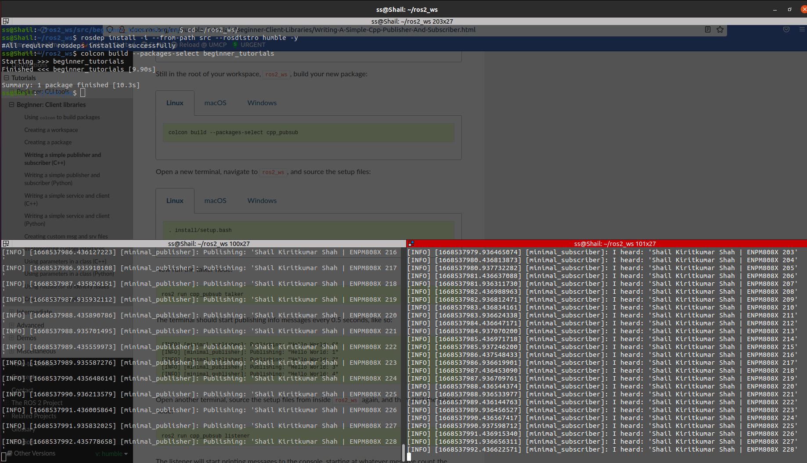

[](https://opensource.org/licenses/Apache-2.0)

# ROS Publisher/Subscriber

```
Name - Shail Kiritkumar Shah

UID - 119340547

Assignment - ROS Publisher/Subscriber (Week 9 & 10)
```

## Overview

* This assignment starts off after installing ROS 2(Humble) and introduces the basic concepts by understanding the tutorials. Familiarizing with ROS 2 terminology like node, topic, services, parameters and actions, the next tasks has following chronology:

1) Create a workspace to store all the ROS2 packages.

2) Create a package named "beginner_tutorials" and build using *colcon build*.

3) Modify the *package.xml* file to add description, maintainer details and licenses, if needed.

4) Write a simple publisher and subscriber node as described in assignment deliverables.



5) Modified the code to adhere to *Google C++ Style Guide* using clang-format.

6) Updated *package.xml* and *CMakeLists.txt* to add dependencies and executables.

7) Ran cpplint and cppcheck by creating a .sh file and saved output in '*result*' folder. 


8) Updated *readme.md* file to inculcate build and run steps.


## Dependencies

| Type     | Description |
| ----------- | ----------- |
| Operating System     | Ubuntu Linux 20.04       |
| ROS version   | ROS 2 - Humble        |
| ROS Code dependencies | rclcpp (ROS Client Lib for C++)
| | stdmsgs (Stores ROS message types)


## Build instructions

Open terminal from source directory of ROS2 workspace or navigate to the path from *Home* using following command:
```
cd ~/ros2_ws/src
```
Clone GitHub repository:
```
git clone --recursive https://github.com/sshah115/beginner_tutorials.git
```
Build the ROS2 package by going back to workspace's root directory:
```
cd ~/ros2_ws
```
Checking for any missing dependencies before building:
```
rosdep install -i --from-path src --rosdistro humble -y
```
Build package:
```
colcon build --packages-select beginner_tutorials
```


## Run instructions

Next step is to run the program and for that open a new terminal and navigate to ROS2 workspace:
```
cd ~/ros2_ws
```
Source the setup files:
```
. install/setup.bash
```
Now run the talker node:
```
ros2 run beginner_tutorials talker
```
Open another terminal, source the setup files from inside ros2_ws again, and then start the listener node:
```
ros2 run beginner_tutorials listener
```

## Run cpp-tests
To check for cpptests i.e cpplint & cppcheck, just write following command from package directory to output and save *.txt* file in *result* folder:
```
sh cpptests.sh
```
