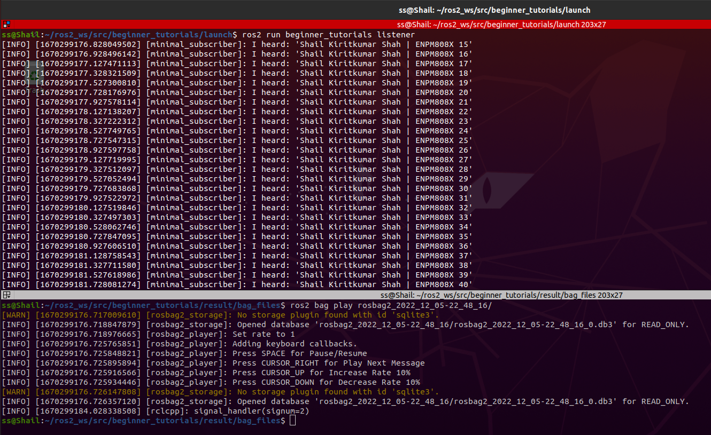

[](https://opensource.org/licenses/Apache-2.0)

# ROS 2 tf2, unit testing, bag files

```
Name - Shail Kiritkumar Shah

UID - 119340547

Assignment - ROS 2 tf2, unit testing, bag files (Week 11)
```

## Overview

* This assignment is designed to understand the concept of tf2 (transformation frame) which is a tranform library for ROS2 and which maintains relationship between coordinate frames. So, the assignment had following tasks:

1) Modify Talker node to broadcast a tf frame called /talk with parent /world. 


2) Verifying TF frames using tf2_echo and use view_frames to show relationship between coordinate frames - World and Talk.


3) Use gtest to create a Level 2 integration test, that tests your Talker node. And ensured it is passing as shown below.


4) Written a ROS launch file to launch ROS 2 bag and record all topics. Add an argument flag to the launch file that can disable/enable bag recording.


5) Record a bag file for ~15 seconds. Verify /chatter topic messages were collected using "ros2 bag info".


6) Run the Listener node ONLY (not Talker), and in another terminal use "ros2 bag play" to replay the topic messages. Verified that listener is printing messages.


7) Ran cpplint and cppcheck by creating a '*.sh*' file and saved output in '*result*' folder. 

8) Added open source license to the repository, cpp files, and modified the license tag in package.xml.

9) Updated *readme.md* file to inculcate build and run steps.

## Dependencies

| Type     | Description |
| ----------- | ----------- |
| Operating System     | Ubuntu Linux 20.04       |
| ROS version   | ROS 2 - Humble        |
| ROS Code dependencies | rclcpp (ROS Client Lib for C++)
| | stdmsgs (Stores ROS message types)
| | geometry_msgs 
| | tf2 
| | tf2_ros


## Build instructions

Open terminal from source directory of ROS2 workspace or navigate to the path from *Home* using following command:
```
cd ~/ros2_ws/src
```
Clone GitHub repository:
```
git clone --recursive https://github.com/sshah115/beginner_tutorials.git
```
Build the ROS2 package by going back to workspace's root directory:
```
cd ~/ros2_ws
```
Checking for any missing dependencies before building:
```
rosdep install -i --from-path src --rosdistro humble -y
```
Build package:
```
colcon build --packages-select beginner_tutorials
```


## Run instructions

Next step is to run the program and for that open a new terminal and navigate to ROS2 workspace:
```
cd ~/ros2_ws
```
Source the setup files:
```
. install/setup.bash
```
### **Running nodes using launch.yaml**
Navigate to launch folder:
```
cd ~/ros2_ws/src/beginner_tutorials/launch
```
Run launch file:
```
ros2 launch launch.yaml frequency:=1.0
```
Note: The default frequency is set to 5.0 Hz

### **Running nodes individually**
Firstly run the server node to facilitate talker node initialization from */ros2_ws* directory:
```
. install/setup.bash
ros2 run beginner_tutorials server
```
Now open a new terminal from inside ros2_ws and run the talker node after sourcing the setup files:
```
ros2 run beginner_tutorials talker
```
Open another terminal, source the setup files from inside ros2_ws again, and then start the listener node:
```
ros2 run beginner_tutorials listener
```
### **Running service call using ros2 service command-line tool**
First navigate to ros2_ws, install setup files and run the server node:
```
cd ~/ros2_ws
. install/setup.bash
ros2 run beginner_tutorials server
```
Then, run the service call command in new terminal after sourcing setup files:
```
ros2 service call /change_string beginner_tutorials/srv/ChangeString "{first_string: "Hello", second_string: "World"}"
```
Note: Shown in image under Overview section

### Modifying frequency parameter using param set
Following command can be used to set a different frequency parameter than the default value:
```
ros2 param set \minimal_publisher freq 0.5
```
Note: Make sure the server node and talker node are initiated beforehand.

## To record bag file

Initiate all the nodes and bag record process by running the launch file by first navigating here:

```
cd ~/ros2_ws/src/beginner_tutorials/launch/
```
Run following code:
```
ros2 launch beginner_tutorials wk11_launch.py bag_record:=True

```

## Run the recorded bag file
Navigate here:
```
cd ~/ros2_ws/src/beginner_tutorials/result/bag_files/
```
Select the bag file with following command:
```
ros2 bag info ...
```
Start the listener node:
```
ros2 run beginner_tutorials listener
```
Play the bag file:
ros2 bag play ...

## Run cpp-tests
To check for cpptests i.e cpplint & cppcheck, just write following command from package directory to output and save *.txt* file in *result* folder:
```
sh cpptests.sh
```
## Result


