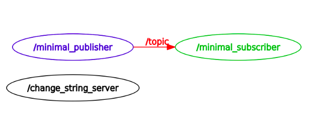

[](https://opensource.org/licenses/Apache-2.0)

# ROS Services, Logging, and Launch files

```
Name - Shail Kiritkumar Shah

UID - 119340547

Assignment - ROS Services, Logging, & Launch files (Week 10)
```

## Overview

* This assignment starts off after successfully building a simple publisher/subscriber and introduces the basic concepts of services, logging messages and launch file. The previous ROS2 package is modified to accomodate the server/client and logging messages concept, the next tasks has following chronology:

1) A server/client pair is created by creating a '*.._server.cpp*' file and including client in the publisher *.cpp* file which requests a string change.

2) All logging level messages are defined in event of parameter change and printed on *rqt_console*. Note: Debug logging messages are hidden and aren't shown on console as also mentioned in following reference:


3) Created '*launch.yaml*' file to run both nodes simultaneously and also to edit parameter if needed or set default value.

4) Captured rqt images i.e '*rqt_console*' and '*rqt_graph*' while running both nodes to capture logging levels and publisher, subscriber and server relationship.

5) Modified the code to adhere to *Google C++ Style Guide* using *clang-format* and provided *doxygen* comments.

6) Updated *package.xml* and *CMakeLists.txt* to add dependencies and executables.

7) Ran cpplint and cppcheck by creating a '*.sh*' file and saved output in '*result*' folder. 

8) Added open source license to the repository, cpp files, and modified the license tag in package.xml.

9) Updated *readme.md* file to inculcate build and run steps.

All the above processes of publisher, subscriber, service call, param set, server node and rqt are ran simultaneously and shown below:


## Dependencies

| Type     | Description |
| ----------- | ----------- |
| Operating System     | Ubuntu Linux 20.04       |
| ROS version   | ROS 2 - Humble        |
| ROS Code dependencies | rclcpp (ROS Client Lib for C++)
| | stdmsgs (Stores ROS message types)


## Build instructions

Open terminal from source directory of ROS2 workspace or navigate to the path from *Home* using following command:
```
cd ~/ros2_ws/src
```
Clone GitHub repository:
```
git clone --recursive https://github.com/sshah115/beginner_tutorials.git
```
Build the ROS2 package by going back to workspace's root directory:
```
cd ~/ros2_ws
```
Checking for any missing dependencies before building:
```
rosdep install -i --from-path src --rosdistro humble -y
```
Build package:
```
colcon build --packages-select beginner_tutorials
```


## Run instructions

Next step is to run the program and for that open a new terminal and navigate to ROS2 workspace:
```
cd ~/ros2_ws
```
Source the setup files:
```
. install/setup.bash
```
### **Running nodes using launch.yaml**
Navigate to launch folder:
```
cd ~/ros2_ws/src/beginner_tutorials/launch
```
Run launch file:
```
ros2 launch launch.yaml frequency:=1.0
```
Note: The default frequency is set to 5.0 Hz

### **Running nodes individually**
Firstly run the server node to facilitate talker node initialization from */ros2_ws* directory:
```
. install/setup.bash
ros2 run beginner_tutorials server
```
Now open a new terminal from inside ros2_ws and run the talker node after sourcing the setup files:
```
ros2 run beginner_tutorials talker
```
Open another terminal, source the setup files from inside ros2_ws again, and then start the listener node:
```
ros2 run beginner_tutorials listener
```
### **Running service call using ros2 service command-line tool**
First navigate to ros2_ws, install setup files and run the server node:
```
cd ~/ros2_ws
. install/setup.bash
ros2 run beginner_tutorials server
```
Then, run the service call command in new terminal after sourcing setup files:
```
ros2 service call /change_string beginner_tutorials/srv/ChangeString "{first_string: "Hello", second_string: "World"}"
```
Note: Shown in image under Overview section

### Modifying frequency parameter using param set
Following command can be used to set a different frequency parameter than the default value:
```
ros2 param set \minimal_publisher freq 0.5
```
Note: Make sure the server node and talker node are initiated beforehand.

## Run cpp-tests
To check for cpptests i.e cpplint & cppcheck, just write following command from package directory to output and save *.txt* file in *result* folder:
```
sh cpptests.sh
```
## Result



